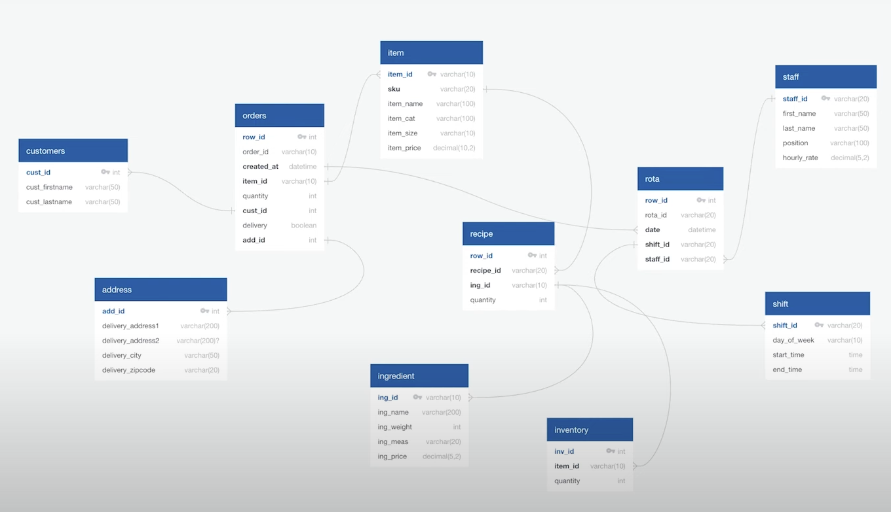

# Sports Ball Classifier
*Abstract*: The purpose of this project was to gain an understanding of Relational Database Management Systems (RDBMS) and Structured Query Language (SQL) by developing a database for a pizza restaurant. The project involved creating tables, populating them with data, and using SQL queries to extract relevant information for analysis. 

Note: Next step in this project is to use Tableau,R, or amy other visualization software to analyze the data.

Files:

* Data: Folder with all csv files that were used to populate created tabes in the database (credits: https://www.youtube.com/watch?v=0rB_memC-dA&t=2594s)
* Create_DB.sql: SQL code used to create the database.
* Querries.sql: SQL code that was used to querry the data and create additional tables that would be used in further analysis/visualizations.

An overview of how my database looks like:

